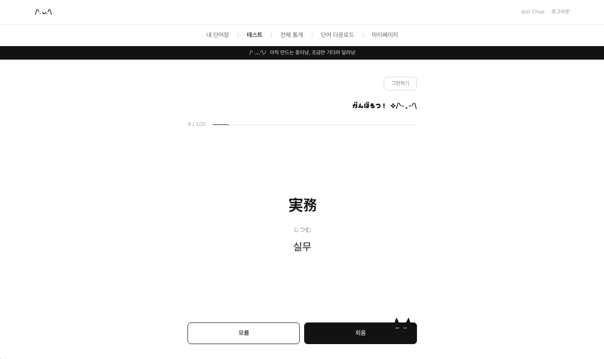
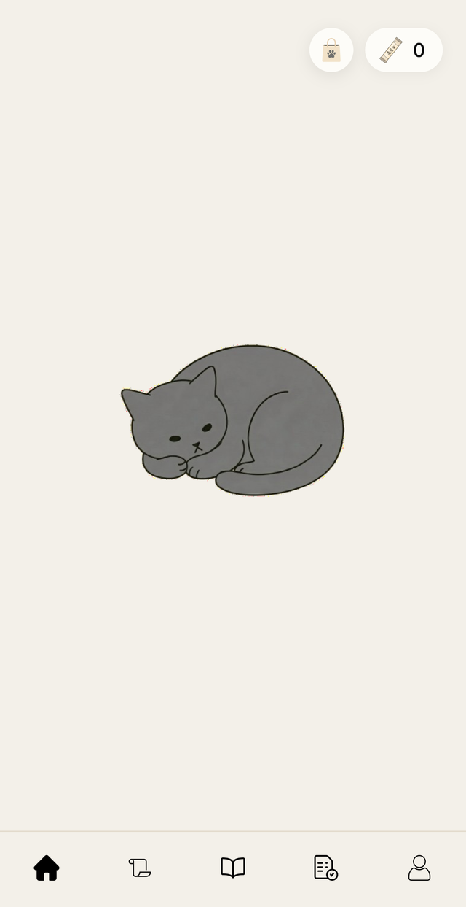
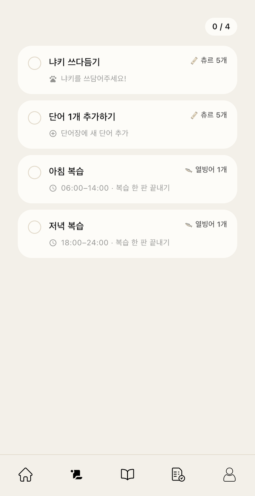
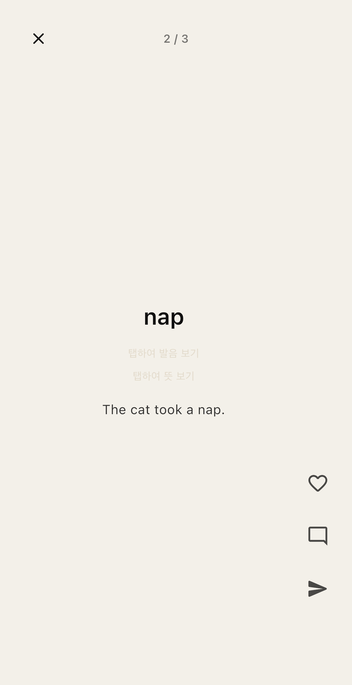
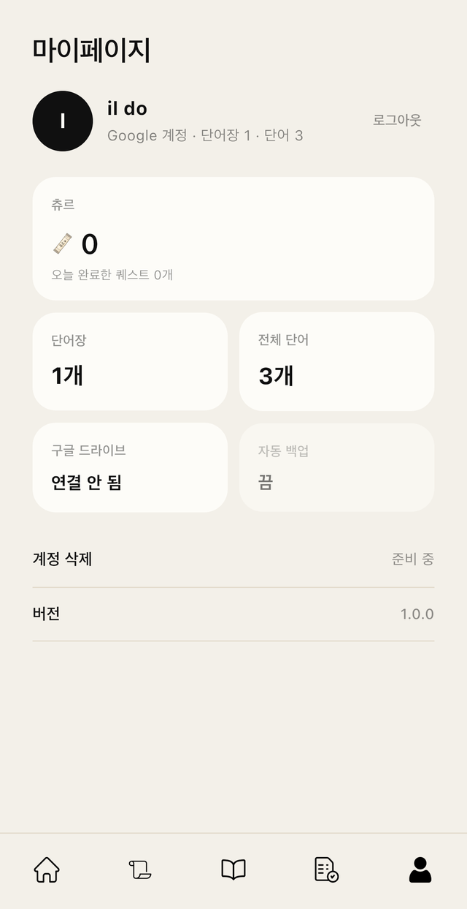
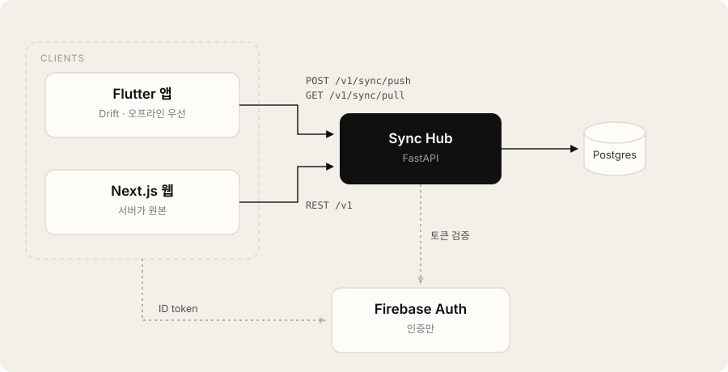

# Nyaki (냐키)

[日本語](README.md) · **한국어**

> 웹과 iOS에서 같은 단어장이 이어지는, 미니멀 단어장.

외국어 공부를 좋아해서 여러 단어 앱을 써 봤습니다. 책상에서는 웹, 밖에서는 폰으로 쓰는데
같은 단어장이 웹과 앱 사이에서 이어지지 않는 점이 늘 아쉬웠습니다.
그래서 웹과 iOS에서 같은 단어장을 실시간으로 동기화하고, 길에서 마주친 단어를 OCR로 그 자리에서
저장할 수 있는 제 전용 단어장을 만들기로 했습니다.

지하철처럼 통신이 불안정한 곳에서도 학습이 끊기지 않도록 모바일은 **오프라인 우선**으로 설계했고,
연결이 돌아오면 **변경분만** 보냅니다. 단어 등록부터 복습까지 제가 매일 쓰는 것을 전제로 만들고 있는
진행 중인 프로젝트입니다.

---

## 화면

### Web — 책상에서



<sub>복습 세션. 채점은 "모름 / 외움" 두 선택지뿐이다. 단어장 편집·전체 통계·단어 다운로드도 웹에서 한다.</sub>

### App (iOS) — 밖에서

<table>
  <tr>
    <td width="25%"></td>
    <td width="25%"></td>
    <td width="25%"></td>
    <td width="25%"></td>
  </tr>
  <tr>
    <td align="center"><sub>홈 — 냐키</sub></td>
    <td align="center"><sub>퀘스트 · 재화</sub></td>
    <td align="center"><sub>단어 카드</sub></td>
    <td align="center"><sub>마이페이지</sub></td>
  </tr>
</table>

---

## Tech Stack & Skills

### Mobile (Flutter)
- **Stack:** Flutter, Dart, Drift (SQLite), Firebase Auth
- **Skills:**
  - Drift를 활용한 오프라인 우선(Offline-first) 로컬 DB 설계 및 상태 관리
  - 스와이프 제스처 하나로 채점과 넘기기를 겸하는 직관적인 UX 구현

### Web (Frontend)
- **Stack:** Next.js 16, React 19, TypeScript, Tailwind 4
- **Skills:**
  - 로컬 저장소 의존 없이 서버(Hub) 데이터를 원본으로 직접 통신하는 웹 뷰어/편집기 구현

### Backend (Sync Hub)
- **Stack:** FastAPI, Python, PostgreSQL, SQLAlchemy 2, Alembic
- **Skills:**
  - 로컬/서버 간 Cursor 기반 증분 동기화(Incremental Sync) API 설계
  - `(id, user_id)` 복합 PK를 활용한 데이터 격리 및 Firebase Auth 연동 토큰 검증

### 인프라 & 배포 (DevOps)
- **Stack:** AWS Lightsail, Docker Compose, Caddy, GitHub Actions
- **Skills:**
  - GitHub Actions를 활용한 rsync 자동 배포 파이프라인 구축
  - 코드 푸시 시 API 컨테이너만 독립적으로 재빌드되도록 최적화

---

## 아키텍처



<sub>앱은 로컬 DB에 먼저 쓰고 변경분만 push / pull 하고, 웹은 서버를 원본으로 직접 CRUD 한다.
Firebase는 인증만 맡고 데이터는 전부 자체 Hub에 둔다.</sub>

---

## ✨ 핵심 경험 및 트러블슈팅

* **네트워크 비용을 줄이는 증분 동기화 설계:**
  전체 데이터를 매번 주고받는 대신, 로컬 변경 사항을 `SyncOutbox`에 쌓아 100건 단위로 Push하고
  마지막 커서 이후의 데이터만 Pull 하도록 동기화 파이프라인을 구축했습니다.

* **데이터 특성에 따른 충돌(Conflict) 해결 전략:**
  오프라인 기기 간 동기화 시, 재화나 퀘스트 같은 누적형 데이터가 '최신 수정(updated_at) 우선' 규칙 때문에
  증발하는 문제를 파악했습니다. 이를 해결하기 위해 퀘스트 판정 및 재화 계산은 서버에서만 멱등성(idempotent) 있게
  처리하고 앱은 결과만 받아오도록 역할을 분리했습니다.

* **멀티 플랫폼 알고리즘(SM-2) 정합성 확보:**
  앱(Dart)과 서버(Python) 양쪽에서 복습 알고리즘을 계산할 때, 언어별 표준 `round()` 함수의 차이로 인해
  복습일이 어긋나는 문제를 발견했습니다. 반올림 정책을 통일하고 동일한 테스트 벡터를 공유하여
  클라이언트 간 오차를 완벽히 없앴습니다.

* **가용성을 고려한 의도적 트레이드오프:**
  동기화 트랜잭션 중 FK 위반 발생 시 커서까지 롤백되어 배치 전송이 영구 정지되는 교착 상태를 방지하기 위해,
  FK를 끄고 앱 레벨에서 무결성을 보장하도록 설계 방향을 문서화했습니다.

---

## 주요 기능

- **단어장 관리:** 단어 CRUD, 태그, 북마크, 이미지 첨부, 예문/발음/메모 지원
- **간격 반복 학습 (SM-2):** 알고리즘 기반 복습 일정 최적화 및 제스처 기반 채점
- **게이미피케이션:** KST 자정 기준으로 갱신되는 고양이 쓰다듬기, 아침/저녁 복습 퀘스트
- **웹 전용 기능:** 단어 팩 다운로드 및 PC 환경에 최적화된 단어장 편집 기능
- **OCR 단어 저장:** 설계 중 ([docs/DRIVE-PLAN.md](docs/DRIVE-PLAN.md))

---

## 구조

```
nyaki/
├── lib/     Flutter 앱
├── web/     Next.js 웹
├── api/     Sync Hub (FastAPI + Postgres)
└── docs/    아키텍처 · 할 일 · 기획
```

## 실행

```bash
# 서버 — 자세한 환경 변수는 api/README.md
cd api && docker compose up --build     # http://localhost:8000/docs

# 웹
cd web && npm install && npm run dev    # http://localhost:3000

# 앱
flutter pub get && flutter run
```

## 테스트

```bash
cd api && pytest      # 동기화 · SRS · 게이미피케이션 · 콘텐츠
flutter test          # SM-2 계산 · 진행도 저장소
```

## 문서

| 문서 | 내용 |
|---|---|
| [docs/ARCHITECTURE.md](docs/ARCHITECTURE.md) | 도메인 모델 · ERD · API · 동기화 결함 분석 · SRS 스펙 · 디자인 토큰 · 보안 점검 |
| [docs/TASKS.md](docs/TASKS.md) | 할 일 · 출시 전 필수 · 기술부채 |
| [docs/PLANS.md](docs/PLANS.md) | 착수 전 기획 |
| [api/README.md](api/README.md) | 로컬 실행 · 환경 변수 · 배포 절차 |
