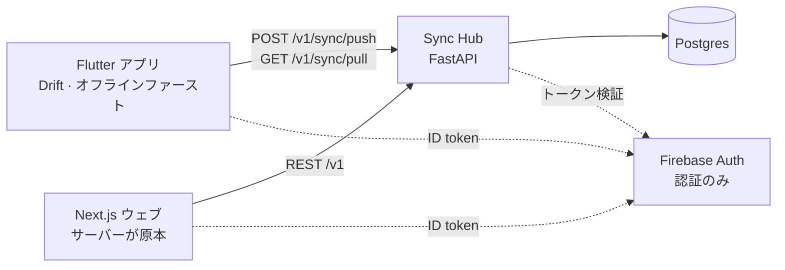

# Nyaki (ニャキ)

**日本語** · [한국어](README.ko.md)

> ウェブと iOS で同じ単語帳がつながる、ミニマルな単語帳アプリ。

外国語の勉強が好きで、単語アプリをいくつも使ってきました。机ではウェブ、外ではスマホで使うのですが、
同じ単語帳がウェブとアプリの間でつながらないことがずっと不満でした。
そこで、ウェブと iOS で同じ単語帳をリアルタイムに同期し、街で見かけた単語を OCR でその場で保存できる、
自分専用の単語帳を作ることにしました。

地下鉄のように通信が不安定な場所でも学習が途切れないよう、モバイルは**オフラインファースト**で設計し、
接続が戻ったら**差分だけ**を送ります。単語の登録から復習まで、自分が毎日使うことを前提に作っている進行中のプロジェクトです。

---

## 画面

### Web — 机の上で


<sub>復習セッション。採点は「わからない / 覚えた」の二択だけ。単語帳の編集・全体統計・単語パックのダウンロードもウェブから。</sub>

### App (iOS) — 外で

<table>
  <tr>
    <td width="25%"></td>
    <td width="25%"></td>
    <td width="25%"></td>
    <td width="25%"></td>
  </tr>
  <tr>
    <td align="center"><sub>ホーム — ニャキ</sub></td>
    <td align="center"><sub>クエストと通貨</sub></td>
    <td align="center"><sub>単語カード</sub></td>
    <td align="center"><sub>マイページ</sub></td>
  </tr>
</table>

---

## Tech Stack & Skills

### Mobile (Flutter)
- **Stack:** Flutter, Dart, Drift (SQLite), Firebase Auth
- **Skills:**
  - Drift によるオフラインファーストのローカル DB 設計と状態管理
  - スワイプ一つで採点と次へ送りを兼ねる操作の実装

### Web (Frontend)
- **Stack:** Next.js 16, React 19, TypeScript, Tailwind 4
- **Skills:**
  - ローカルストレージに依存せず、サーバー (Hub) を原本として直接通信するビューア／エディタの実装

### Backend (Sync Hub)
- **Stack:** FastAPI, Python, PostgreSQL, SQLAlchemy 2, Alembic
- **Skills:**
  - ローカルとサーバー間の cursor ベース増分同期 (Incremental Sync) API の設計
  - `(id, user_id)` 複合主キーによるユーザー分離と、Firebase Auth 連携のトークン検証

### インフラ・デプロイ (DevOps)
- **Stack:** AWS Lightsail, Docker Compose, Caddy, GitHub Actions
- **Skills:**
  - GitHub Actions と rsync による自動デプロイパイプラインの構築
  - コードの push 時に API コンテナだけを独立して再ビルドする最適化

---

## アーキテクチャ



---

## ✨ 設計上の判断とトラブルシューティング

* **通信量を抑える増分同期の設計:**
  毎回すべてを送受信する代わりに、ローカルの変更を `SyncOutbox` に貯めて 100 件単位で push し、
  最後の cursor 以降の差分だけを pull する同期パイプラインを構築しました。

* **データの性質に応じた競合解決:**
  オフライン端末どうしの同期で、通貨やクエストのような**累積値**が「更新時刻 (updated_at) が新しい方が勝つ」規則によって
  消えてしまう問題を特定しました。通貨の計算とクエストの完了判定はサーバーだけが冪等 (idempotent) に行い、
  アプリは結果を受け取るだけ、と役割を分けて解決しました。

* **マルチプラットフォームでのアルゴリズム (SM-2) の一致:**
  アプリ (Dart) とサーバー (Python) の両方で復習アルゴリズムを計算する際、言語標準の `round()` の丸め方の違いで
  次回復習日がずれる問題を発見しました。丸め規則を統一し、同一のテストベクタを両者で共有することで差異をなくしました。

* **可用性を優先した意図的なトレードオフ:**
  同期トランザクション中に FK 違反が起きると cursor までロールバックされ、同じバッチを永久に再試行する膠着状態に陥ります。
  これを避けるため FK を無効にし、アプリ側で整合性を保証する方針とその根拠を文書に残しました。

---

## 主な機能

- **単語帳:** 単語の CRUD、タグ、ブックマーク、画像添付、例文・発音・メモ
- **間隔反復学習 (SM-2):** アルゴリズムによる復習スケジューリングと、スワイプによる採点
- **ゲーミフィケーション:** KST の深夜 0 時で切り替わる「ニャキを撫でる」「朝／夜の復習」クエスト
- **ウェブ専用:** 単語パックのダウンロードと、PC 向けに最適化した単語帳編集
- **OCR での単語保存:** 設計中 ([docs/DRIVE-PLAN.md](docs/DRIVE-PLAN.md))

---

## 構成

```
nyaki/
├── lib/     Flutter アプリ
├── web/     Next.js ウェブ
├── api/     Sync Hub (FastAPI + Postgres)
└── docs/    アーキテクチャ · タスク · 企画
```

## 実行

```bash
# サーバー — 環境変数の詳細は api/README.md
cd api && docker compose up --build     # http://localhost:8000/docs

# ウェブ
cd web && npm install && npm run dev    # http://localhost:3000

# アプリ
flutter pub get && flutter run
```

## テスト

```bash
cd api && pytest      # 同期 · SRS · ゲーミフィケーション · コンテンツ
flutter test          # SM-2 の計算 · 進捗リポジトリ
```

## ドキュメント

| ドキュメント | 内容 |
|---|---|
| [docs/ARCHITECTURE.md](docs/ARCHITECTURE.md) | ドメインモデル · ERD · API · 同期の欠陥分析 · SRS 仕様 · デザイントークン · セキュリティ点検 |
| [docs/TASKS.md](docs/TASKS.md) | タスク · リリース前の必須項目 · 技術的負債 |
| [docs/PLANS.md](docs/PLANS.md) | 着手前の企画 |
| [api/README.md](api/README.md) | ローカル実行 · 環境変数 · デプロイ手順 |
