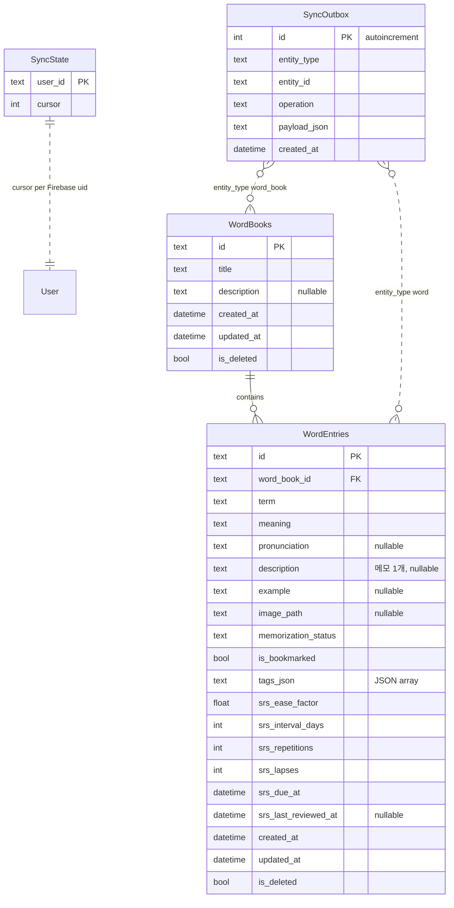

# App ERD — Flutter 로컬 (Drift)

Flutter 앱이 기기에 저장하는 스키마와 동기화 보조 테이블 정리.

> **웹 ERD가 아님.** Next.js 웹은 DB가 없고 Hub REST API만 사용한다.  
> Hub(Postgres) 스키마는 [api/app/models.py](api/app/models.py) · [docs/DOMAIN.md](docs/DOMAIN.md) 참고.  
> 도메인 필드 규칙(암기 상태, soft delete 등)은 앱·웹·Hub가 같은 `Word` / `WordBook` 모델을 따른다.

---

## 범위 한눈에

| 클라이언트 | 저장소 | 이 문서 |
|-----------|--------|---------|
| **Flutter 앱** | Drift (SQLite) | ✅ 아래 ERD |
| **웹** | 없음 (메모리 + API) | ❌ |
| **Sync Hub** | Postgres | ❌ (별도) |

구현: [lib/data/local/tables.dart](lib/data/local/tables.dart)  
런타임 모델: [lib/models/word.dart](lib/models/word.dart), [lib/models/word_book.dart](lib/models/word_book.dart)

---

## Drift ERD



---

## 테이블 설명

### `WordBooks` → 도메인 `WordBook`

| Column (Drift) | Domain | Notes |
|----------------|--------|-------|
| `id` | `id` | PK, UUID 권장 |
| `title` | `title` | |
| `description` | `description` | 단어장 설명 (단어 메모와 무관) |
| `created_at` | `createdAt` | |
| `updated_at` | `updatedAt` | 충돌 시 Hub와 비교 |
| `is_deleted` | `isDeleted` | soft delete |

목록의 `N개 · N%` 등은 DB 컬럼이 아니라 클라이언트 계산.

### `WordEntries` → 도메인 `Word`

| Column (Drift) | Domain | Notes |
|----------------|--------|-------|
| `id` | `id` | PK |
| `word_book_id` | `wordBookId` | FK → `WordBooks.id`, cascade delete |
| `term` | `term` | |
| `meaning` | `meaning` | |
| `pronunciation` | `pronunciation` | |
| `description` | `description` | **메모 1개** (`string?`) |
| `example` | `example` | 예문 |
| `image_path` | `imagePath` | 로컬 파일 경로 (프로토타입) |
| `memorization_status` | `memorizationStatus` | `unmemorized` \| `memorized` |
| `is_bookmarked` | `isBookmarked` | 테스트 화면 하트 등 |
| `tags_json` | `tags` | `List<String>` 직렬화 |
| `srs_ease_factor` | `srsEaseFactor` | SM-2 ease, 기본 `2.5` |
| `srs_interval_days` | `srsIntervalDays` | 기본 `0` |
| `srs_repetitions` | `srsRepetitions` | 기본 `0` |
| `srs_lapses` | `srsLapses` | 기본 `0` |
| `srs_due_at` | `srsDueAt` | 복습 큐 정렬 키. 기본 `created_at` |
| `srs_last_reviewed_at` | `srsLastReviewedAt` | nullable |
| `created_at` | `createdAt` | |
| `updated_at` | `updatedAt` | |
| `is_deleted` | `isDeleted` | soft delete |

여러 메모를 쓰려면 현재 스키마로는 불가 — `description` 단일 필드만 존재.

### `SyncOutbox` (앱 전용)

로그인 후 Hub로 보낼 변경 큐. Drift에 쓴 뒤 `SyncCoordinator`가 push.

| Column | Notes |
|--------|-------|
| `entity_type` | 예: `word_book`, `word` |
| `entity_id` | 대상 id |
| `operation` | create / update / delete 등 |
| `payload_json` | Hub sync payload |

### `SyncState` (앱 전용)

사용자(Firebase `uid`)별 마지막 pull **cursor**.

| Column | Notes |
|--------|-------|
| `user_id` | PK |
| `cursor` | Hub `sync_changes.cursor` 와 맞춤 |

---

## Hub와의 차이 (참고)

앱 Drift에는 **`user_id` 컬럼 없음** — 기기는 한 사용자 로컬 사본.  
Hub `word_books` / `words`는 `(id, user_id)` 복합 PK로 테넌트 격리.

```
앱:  WordBooks ──< WordEntries     (+ SyncOutbox, SyncState)
Hub: word_books ──< words          (+ sync_changes, user_id on rows)
웹:  (저장 없음) → GET/POST /v1/...
```

---

## 관련 문서

- 도메인 규칙: [docs/DOMAIN.md](docs/DOMAIN.md)
- API 페이로드: [docs/API.md](docs/API.md)
- SRS 계산 로직: [docs/SRS.md](docs/SRS.md) · 제품/UX: [docs/SRS-PLAN.md](docs/SRS-PLAN.md)
- 디자인 토큰: [Design.md](Design.md)
