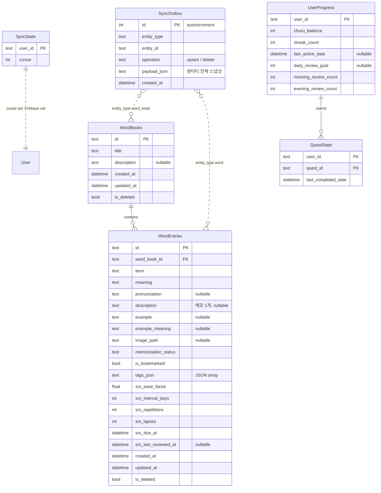
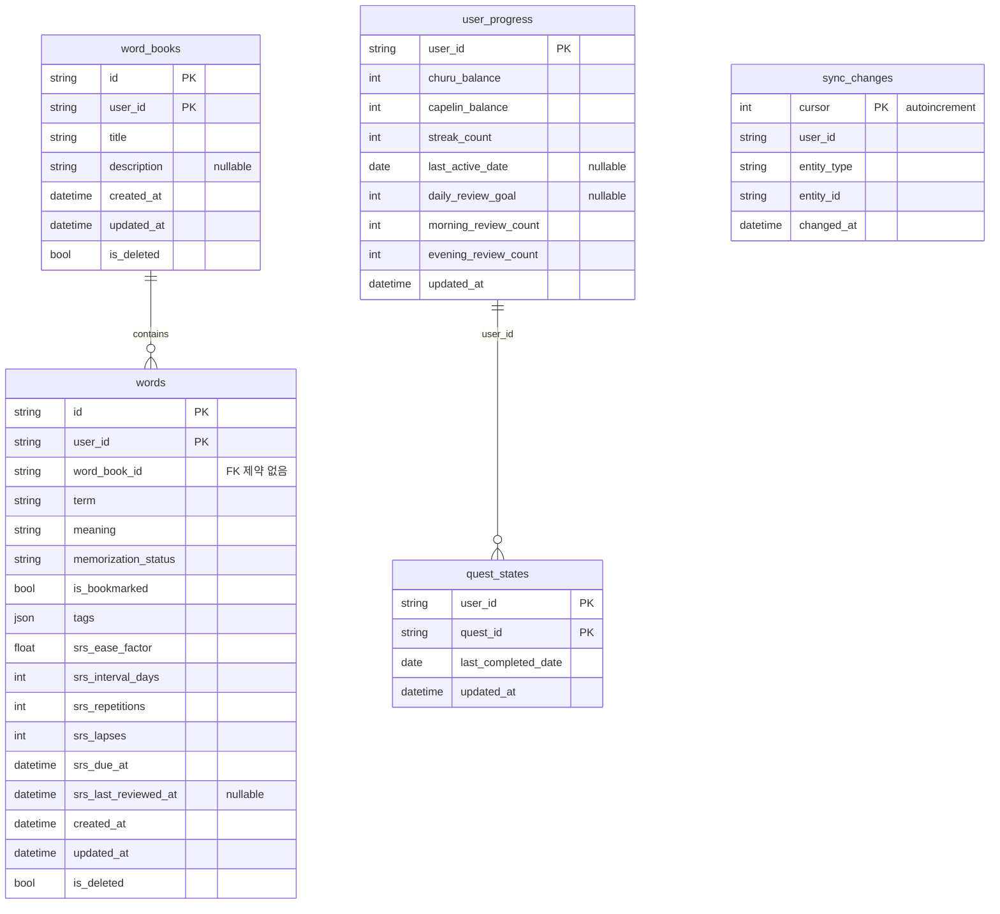

# Nyaki 아키텍처

> 시스템 구성 · 도메인 모델 · ERD · API · 동기화 · SRS · 디자인 토큰 · 보안.
> 2026-09-01 통합 (기존 ERD/DOMAIN/API/SRS/app_erd/hub_erd/Design/SECURITY + 동기화 결함 분석).
> 스키마가 바뀌면 **여기에 반영**한다.

---

## 0. 시스템 구성

| 클라이언트 | 저장소 | 서버 통신 |
|---|---|---|
| **Flutter 앱** | Drift (SQLite), 기기당 한 사용자 (`user_id` 컬럼 없음) | outbox → `POST /v1/sync/push` + `GET /v1/sync/pull` |
| **Next.js 웹** | 없음 (메모리 + API) | REST CRUD 직접 호출 |
| **Hub** (`api/`, FastAPI) | Postgres, `(id, user_id)` 복합 PK로 사용자 격리 | — |

인증은 Firebase ID 토큰. Firebase는 **인증만** 담당하고 데이터는 전부 자체 Hub에 둔다.

구현: `lib/data/local/tables.dart` · `api/app/models/` · `api/app/vocab/`

---

## 1. 도메인 모델

도메인은 둘이다 — **vocab**(단어장·단어)과 **게이미피케이션**(재화·퀘스트).
필드 정의는 여기 한 번만 두고, 저장소별 그림은 §2에 있다.

같은 개념이 계층마다 이름이 다르다.

| 도메인 | 앱 Dart 모델 | 앱 Drift 테이블 | Hub ORM | Postgres |
|---|---|---|---|---|
| WordBook | `WordBook` | `WordBooks` | `WordBookModel` | `word_books` |
| Word | `Word` | `WordEntries` | `WordModel` | `words` |
| UserProgress | — | `UserProgress` | `UserProgressModel` | `user_progress` |
| QuestState | — | `QuestState` | `QuestStateModel` | `quest_states` |

### 1.1. vocab

```
WordBook (1) ──────< (N) Word
```

한 단어는 하나의 단어장에만 속한다. (책장 도입 시 `Bookshelf (1) ──< (N) WordBook` 추가 — PLANS.md)

#### WordBook

| Field | Type | 필수 | Notes |
|---|---|:---:|---|
| `id` | string | O | 클라이언트 생성 UUID |
| `title` | string | O | Hub 검증 `min_length=1, max_length=200` |
| `description` | string? | | |
| `created_at` / `updated_at` | datetime | O | `updated_at`은 충돌 해소 키 |
| `is_deleted` | bool | O | soft delete |

**클라이언트 계산 필드** — `wordCount`(활성 단어 수) · `memorizedCount` · `learningRate`(0–100) · `metaLabel`(`N개 · 암기 N%`) · `dueWords`/`dueCount`

> `learningRate`는 `isMemorized`(= `repetitions >= 2`) 이진 플래그 기반이라,
> 단어장 정보 탭의 **'단어장 암기율'**(로그 스케일, TASKS.md 참고)과 정의가 다르다.
> 한 앱에 "암기"가 두 뜻으로 있는 상태 — 통일 필요.

#### Word

| Field | Type | 필수 | Notes |
|---|---|:---:|---|
| `id` / `word_book_id` | string | O | |
| `term` | string | O | Hub 검증 `min_length=1, max_length=500` |
| `meaning` | string | O | Hub 검증 `min_length=1` |
| `pronunciation` / `description` / `example` / `example_meaning` | string? | | `description` = 메모 1개 (복수 메모 불가) |
| `image_path` | string? | | 로컬 경로 또는 URL. `assets/` 접두사면 번들 에셋 |
| `memorization_status` | enum | O | `unmemorized` \| `memorized` — SRS 채점의 **부수 효과** |
| `is_bookmarked` | bool | O | 기본 `false` |
| `tags` | string[] | O | 기본 `[]`. 로컬은 `tags_json` 직렬화 |
| `srs_ease_factor` | float | O | 기본 `2.5` |
| `srs_interval_days` | int | O | 기본 `0` |
| `srs_repetitions` | int | O | 연속 성공, 기본 `0` |
| `srs_lapses` | int | O | 누적 실패, 기본 `0` |
| `srs_due_at` | datetime | O | 기본 `created_at`(즉시 due) |
| `srs_last_reviewed_at` | datetime? | | 한 번도 채점 안 했으면 `null` |
| `created_at` / `updated_at` | datetime | O | |
| `is_deleted` | bool | O | soft delete |

#### 규칙

1. 새 단어 기본 상태: `unmemorized`, SRS 즉시 due
2. 내용·암기 상태·SRS 채점 변경 시 `updated_at` 갱신
3. 삭제는 **soft delete** — 목록·암기율·복습 큐에서 제외
4. Hub PK는 `(id, user_id)`
5. 충돌: `updated_at` 최신 wins — **row 전체 단위**(SRS 필드도 예외 아님)

### 1.2. 게이미피케이션

```
UserProgress (1) ──────< (N) QuestState
```

유저당 진행 상태 1행, 그 아래 퀘스트별 상태가 붙는다.

#### UserProgress

| Field | Type | 필수 | Notes |
|---|---|:---:|---|
| `user_id` | string | O | Firebase uid, PK |
| `churu_balance` | int | O | 츄르 잔액. 기본 `0` |
| `capelin_balance` | int | O | 열빙어 잔액. 기본 `0` |
| `streak_count` | int | O | 연속 학습일. 기본 `0` |
| `last_active_date` | date? | | 마지막 활동일 |
| `daily_review_goal` | int? | | 아침/저녁 복습 퀘스트 목표치 |
| `morning_review_count` / `evening_review_count` | int | O | 시간대별 복습 카운터. 기본 `0` |

**재화 두 종류** — 츄르는 가벼운 참여(탭 1회)의 보상이고, 열빙어는 실제 복습에만 나온다.
소비처를 갈라 "꾸준히 복습해야 얻는 것"이라는 포지셔닝을 유지한다(PLANS.md §1-4).

#### QuestState

| Field | Type | 필수 | Notes |
|---|---|:---:|---|
| `user_id` / `quest_id` | string | O | 복합 PK. `quest_id`는 `pet_cat` 등 |
| `last_completed_date` | date | O | "오늘 이미 했나" 판정 기준 |

#### 규칙

1. **Hub가 진실, 앱은 캐시** — 잔액 계산과 완료 판정은 서버만 한다
2. 유저×퀘스트당 **1행 UPSERT** — 완료 이력 로그가 아니다. 필요한 정보는 "마지막으로 언제 완료했나" 하나뿐인데 이력을 쌓으면 row가 무한히 는다
3. 하루 경계는 **KST 자정** (서버 판정, `_today()`)
4. 퀘스트 완료 API는 **idempotent** — 같은 날 두 번 호출해도 보상은 한 번

---

## 2. ERD

### 2.1. 앱 로컬 (Drift, schemaVersion 6)



`UserProgress` · `QuestState`는 **Hub 캐시**다. 동기화(outbox/pull)를 타지 않고 서버 응답을 받아 적기만 한다 — §4.8.

**마이그레이션 이력** — v2: `isDeleted` + outbox/state / v3: `isBookmarked`·`tagsJson` / v4: SRS 6컬럼 (기존 row는 `due_at = created_at`) / v5: 게이미피케이션 캐시 2개 / v6: `exampleMeaning`

> `WordEntries.wordBookId`에 `references(WordBooks, #id, onDelete: cascade)` 선언이 있지만,
> 코드베이스 어디에도 `PRAGMA foreign_keys = ON`이 없어 **SQLite 기본값 OFF, 즉 강제되지 않는다.**
> 이건 의도적이다 — 이유는 §4.3.

### 2.2. Hub (Postgres)



`user_progress` · `quest_states`는 동기화 대상이 아니다 — 서버가 직접 갱신한다(§4.8).
웹 콘텐츠용 `ArtistModel` / `PostModel`은 `app/models/content.py`.

**인덱스**

| 테이블 | 인덱스 | 용도 |
|---|---|---|
| `word_books` | `(user_id, updated_at)` | sync pull |
| `words` | `(user_id, updated_at)` | sync pull |
| `words` | `(user_id, word_book_id)` | 단어장별 목록 |
| `words` | `(user_id, is_bookmarked)` | 북마크 필터 |
| `words` | `(user_id, srs_due_at)` | `GET /v1/review/due` |
| `sync_changes` | `(user_id, cursor)` | 증분 pull |
| `bookshelves`(예정) | `(user_id, updated_at)` | |

---

## 3. API

Base `/v1` · `Authorization: Bearer <Firebase ID token>` · ISO 8601 · OpenAPI는 `{base}/docs` · Health `GET /health`

| HTTP | 의미 |
|---|---|
| 401 | 토큰 없음/무효 |
| 403 | 관리자 전용(콘텐츠 쓰기) |
| 404 | 리소스 없음 또는 삭제됨 |
| 400 | URL·payload ID 불일치 |
| 422 | payload 검증 실패 (길이 제한 등) |

### 리소스

| Method | Path | 설명 |
|---|---|---|
| GET | `/v1/word-books` | 목록 (`is_deleted = false`) |
| PUT | `/v1/word-books/{id}` | upsert |
| DELETE | `/v1/word-books/{id}` | soft delete + **하위 단어도 soft delete** (§4.4 결함 B) |
| GET | `/v1/word-books/{id}/words` | 목록 |
| PUT | `/v1/word-books/{id}/words/{wordId}` | upsert |
| DELETE | `/v1/word-books/{id}/words/{wordId}` | soft delete |
| GET | `/v1/review/due?limit=50` | `srs_due_at <= now` 오름차순 (max 200) |
| POST | `/v1/progress/quests/{quest_id}/complete` | idempotent 퀘스트 완료 |
| GET | `/v1/progress` | 잔액 + 오늘 완료 퀘스트 |
| GET/PUT/DELETE | `/v1/content/...` | 웹 콘텐츠 (쓰기는 `require_admin_id`) |

### Sync

**`POST /v1/sync/push`** — 최대 100건 mutation.

```json
{ "changes": [
  { "entity_type": "word", "action": "upsert", "word": { "...Word payload..." } },
  { "entity_type": "word_book", "action": "delete", "word_book": { "...payload..." } }
] }
```
→ `{ "cursor": 42, "accepted": 2 }`

**`GET /v1/sync/pull?cursor=0`** — 해당 cursor **이후** 변경분, 최대 **500건**.
→ `{ "cursor": 42, "changes": [ { "cursor": 41, "entity_type": "word_book", "word_book": { ...현재 스냅샷... } } ] }`

클라이언트는 응답 최상위 `cursor`를 저장해 다음 pull에 쓴다. (개별 `change.cursor`는 안 읽는다)

---

## 4. 동기화

### 4.1 동작

```
로컬 변경 → Drift 쓰기 + SyncOutbox INSERT
   ↓ (SyncCoordinator: 로그인 변화 시 + 20초 타이머)
_push: outbox 100건 → POST /sync/push → 성공하면 그 100건 삭제
_pull: GET /sync/pull?cursor=N → 트랜잭션 안에서 병합 → 마지막에 cursor 저장
```

`sync_pull`은 로그(`sync_changes`)를 순회하되 payload는 `session.get()`으로 **엔티티의 현재 행**을
읽어 만든다. 내려오는 값은 변경 시점 스냅샷이 아니라 지금 값이므로, **오래된 중복 로그에는
정보가 없다** — 정리해도 안전하다(§4.4 C의 근거).

### 4.2 알려진 결함 (2026-09-01 전수 확인)

| # | 결함 | 확률 | 영향 | 발견 가능성 |
|---|---|---|---|---|
| **A** | push 배치에 서버가 거절하는 항목이 하나 섞이면 그 기기의 **모든 변경이 영구히 못 간다**. 표시 없음 | 낮음 | 데이터 유실 | 거의 0 |
| **B** | 단어장 삭제 시 서버는 단어도 지우지만 어느 기기에도 알리지 않는다 | 항상 | 상태 불일치 | 낮음 |
| **C** | `sync_changes` 무한 증가 → 새 기기 첫 동기화가 갈수록 느려짐 | 항상 | 체감 성능 | 중간 |
| **D** | 동기화 경로가 부모 단어장 존재를 확인 안 함 → 서버에 고아 단어 가능 | 낮음 | 정합성 | 낮음 |
| **E** | 병합이 클라이언트 시계를 그대로 믿음 | 낮음 | 갱신 불가 | 낮음 |
| **F** | `sync_pull` N+1 (로그 500줄 = 최대 500쿼리) | 항상 | 서버 부하 | — |
| **G** | pull 결과가 전부 비면 cursor 정체 (현재 발생 불가) | 없음 | 동기화 정지 | — |

### 4.3 결함 A — 배치 전체가 한 건 때문에 막힌다

`_push`는 outbox 100건을 한 묶음으로 보내고, 서버는 한 건이 검증에 걸리면 요청 전체를 422로 거절한다
(FastAPI가 `SyncPushRequest` 파싱 단계에서 막아 나머지 99건은 시도조차 안 됨).
실패 시 outbox를 안 지우므로 20초마다 같은 묶음을 재시도하고, `sync()`의 `catch (_) {}`가
예외를 삼켜 화면에도 로그에도 흔적이 없다.

**길이 제한이 Hub에만 있다는 점이 방아쇠다**(`term` 500자, `title` 200자 — 로컬 Drift엔 없음).
로컬엔 저장되는데 서버는 거절하는 값이 존재할 수 있고, 유입 경로는 긴 문장 붙여넣기·웹 데이터·CSV 가져오기다.
증상은 해당 기기에서만 정상으로 보이고, 다른 기기를 열었을 때 비로소 드러난다.

**수정**
1. 예외 로깅 + 연속 실패 카운터
2. 임계치 초과 시 설정 화면에 배너 — 여기까지만 해도 무증상이 사라진다
3. 4xx면 배치를 반으로 쪼개 문제 1건을 격리(5xx·네트워크 오류는 통째 재시도)
   — **재시도로 풀리는 오류와 아닌 오류를 구분하는 것이 핵심**

**FK를 켜지 않는 이유도 같은 구조다.** `_pull`은 한 트랜잭션에서 병합하고 마지막에 cursor를 저장한다.
FK 위반으로 롤백되면 cursor도 함께 롤백되고, 예외는 삼켜지므로 같은 배치를 영원히 재시도한다.
얻는 것은 이미 앱 코드가 보장하는 무결성이고, 잃는 것은 동기화 영구 정지다.

### 4.4 결함 B·C

**B — 삭제가 절반만 전파된다.** 서버 `delete_word_book`은 단어장과 안의 단어를 모두 soft delete하지만
`sync_changes`에는 단어장 한 건만 기록한다. 앱 `deleteWordBook`은 반대로 단어를 아예 안 지운다.

| | 단어장 | 단어 N개 |
|---|---|---|
| 지운 기기 | 삭제 | **살아 있음** |
| 서버 | 삭제 | 삭제 |
| 다른 기기 | 삭제 | **살아 있음** |

부모가 안 보여 평소엔 드러나지 않다가, 단어장이 되살아나면(오프라인 편집으로 `updated_at`이 역전되는 경로)
지워졌어야 할 단어가 함께 돌아온다.
→ **수정**: 서버가 영향받은 단어에도 `_new_change(..., "word", id)`를 남기고, 앱도 소속 단어를 함께 soft delete
(앱은 outbox에 넣지 않는다 — 서버가 단어장 delete를 받으면 자기 쪽에서 처리하므로 중복).

**C — 로그 무한 증가.** `_new_change`는 변경마다 row를 추가하고 정리가 없다.
하루 50개 × 1년 ≈ 18,000줄, 새 기기는 cursor 0부터 전부 재생하는데 `limit(500)` × 주기당 1회 pull이라
**20초 × 36회 ≈ 12분**이 걸리고 화면엔 표시가 없다.
→ **수정**: 단기는 응답에 `hasMore`를 실어 소진될 때까지 연속 pull(12분 → 수십 초),
중기는 cursor=0 요청에 현재 상태 스냅샷을 내려주거나 `(user_id, entity_type, entity_id)`당 최신 1줄만 남기고 정리.
로컬 `SyncOutbox`도 같은 구조지만 소비자가 이 기기뿐이라, 삽입 전 같은 키의 미전송 row를 지우면 entity당 1행으로 상한이 걸린다.

### 4.5 결함 D·E·F·G

- **D** — REST 경로 `put_word`는 `_get_word_book`으로 부모를 확인하는데 동기화 경로 `_apply_mutation`은 안 한다. 안 터지는 이유가 앱 코드에만 있다
- **E** — `_is_newer`가 비교하는 `updated_at`은 기기가 찍어 보낸 값이다. 시계가 미래로 틀어지면 그 기기가 영원히 이긴다. 완화: `now + 5분`보다 미래면 서버 시각으로 보정 + 경고 로그 (버전 벡터는 이 규모에 과함)
- **F** — 로그 500줄이면 `session.get()`을 최대 500번. `entity_type`별 id를 모아 `IN` 조회 2~3회로 대체. C를 스냅샷 방식으로 고치면 자연 소멸
- **G** — 서버는 `next_cursor = changes[-1].cursor`를 주지만 클라이언트는 `changes`가 비면 cursor를 저장하지 않는다. 삭제가 전부 soft delete라 현재는 발생 불가, 하드 삭제 도입 시 터진다. 수정은 클라이언트 한 줄

### 4.6 `model_dump()` 전체 덮어쓰기

```python
for field, value in payload.model_dump().items():
    setattr(entity, field, value)
```

`model_dump()`는 모든 필드를 뱉는다. 새 필드를 모르는 구버전 클라이언트가 엔티티를 수정하면
그 필드가 기본값으로 덮어써진다 — 구버전이 `example_meaning` 없이 올리면 값이 날아가고,
책장의 `shelf_id`도 같은 경로로 소속이 초기화된다.
→ **수정**: `model_dump(exclude_unset=True)`. 클라이언트가 실제로 보낸 필드만 덮어쓴다.

### 4.7 폴링 — 20초 타이머

바뀐 게 없어도 매번 요청한다. 개인 단어장이라 실시간성이 불필요하고, WebSocket은 모바일
백그라운드 제약으로 이중 구현이 되며, 활성 기기 100대 기준 초당 5건 안팎이라 현 규모에선 문제없다.

남는 낭비는 백그라운드에서도 타이머가 도는 것이다. `WidgetsBindingObserver`로 백그라운드 진입 시 정지 /
포그라운드 복귀 시 재개 + 즉시 1회 `sync()` — "다른 기기에서 고치고 이 기기를 열면 바로 반영"도 함께 해결된다.

### 4.8 동기화 밖에 있는 것 — 게이미피케이션

`user_progress` · `quest_states`는 outbox에도 `sync_changes`에도 들어가지 않는다.

**잔액이 누적값이기 때문이다.** 위 병합 규칙은 "나중에 수정된 쪽이 이긴다"(LWW)인데,
오프라인 두 기기가 각자 5츄르씩 벌면 나중에 올라온 쪽이 다른 쪽을 덮어써서 5가 증발한다.
그래서 잔액과 완료 판정은 **서버만** 하고(`POST /v1/progress/quests/{id}/complete`),
앱은 결과를 받아 적기만 한다.

| | 역할 | 갱신 시점 |
|---|---|---|
| Hub `user_progress` | 진실 | 퀘스트 완료 요청을 받을 때 |
| 앱 Drift `UserProgress` | 캐시 | 앱 시작 · 로그인 직후 · 포그라운드 복귀 (폴링 없음) |

앱은 `loadCached()`로 먼저 그리고 `refresh()`로 서버값을 덮어쓴다.

---

## 5. SRS (SM-2) — 구현 완료

### 5.1 제품 결정

| 항목 | 결정 |
|---|---|
| 알고리즘 | Anki식 **SM-2** |
| 학습자 입력 | **모름 / 외움**만 (Hard/Easy 없음) → 내부 `Again` / `Good` |
| 클라이언트 | **앱만 (v1)** — 웹 복습 UI 보류, 사유는 §5.6 |
| 복습 UX | **좌우 스와이프 = 채점 + 다음** (← 모름 / → 외움), 탭은 뜻 공개 |
| 출제 대상 | `srs_due_at <= now`인 단어만 |
| 세션 개수 | 시작 전 슬라이더 (오래 밀린 순 N개) |

**왜 스와이프인가**: 채점(버튼)과 넘기기(스와이프)를 동시에 두면 조작이 둘로 갈라진다. 한 제스처로 합쳤다.
기각: 버튼만 / 위·아래 스와이프(세로 피드와 충돌).

### 5.2 계산 스펙

`lib/data/srs/sm2.dart`가 이 절을 그대로 따른다.

**Again (모름)**
```
ease   = max(1.3, round2(ease - 0.20))
reps   = 0
lapses = lapses + 1
interval = 0                      # 재학습 상태로 되돌림
due_at   = now + RELEARNING_STEP  # 기본 0 = 즉시 대상
memorization_status = "unmemorized"
```

**Good (외움)**
```
if reps == 0:   interval = 1
elif reps == 1: interval = 3
else:           interval = round_half_up(interval * ease)
reps += 1 ; due_at = now + interval일
if reps >= 2: memorization_status = "memorized"
```
ease는 Good에서 변하지 않는다 (Hard/Easy가 없어 올릴 방법이 없음 — 의도된 동작).

**반올림: round half up 고정** — `int roundHalfUp(double x) => (x + 0.5).floor();`
Dart/Python 표준 `round()`는 banker's rounding이라 안 쓴다. 드문 예외가 아니라 **매번 마주치는 케이스**다 —
신규 단어는 ease 2.5로 시작하므로 한 번도 안 틀린 모든 단어가 3번째에 `3 × 2.5 = 7.5`를 계산한다.

**정밀도·타임존** — ease는 매 갱신 후 소수 둘째 자리로 저장(누적 오차 방지).
`due_at`은 UTC 절대시각 `+N일`("내일"은 정확히 24시간 뒤, 로컬 자정 아님).

**Again = 즉시 재학습** (`relearningStep = Duration.zero`) — v1 초안은 "최소 내일"이었으나 체감이 나빠 없앴다.
같은 세션에서 바로 다시 나오진 않는다(출제 목록이 세션 시작 시 고정). 다음 테스트에 들어갈 때 출제된다.

### 5.3 워크스루 (테스트 벡터)

계속 Good만 받는 경우 (ease 2.5):

| # | ease | reps | interval | due |
|---|---|---|---|---|
| 1 | 2.5 | 0→1 | 1 | +1일 |
| 2 | 2.5 | 1→2 | 3 (→ `memorized`) | +3일 |
| 3 | 2.5 | 2→3 | `round_half_up(3×2.5)` = 8 | +8일 |
| 4 | 2.5 | 3→4 | `round_half_up(8×2.5)` = 20 | +20일 |

4번째에 Again을 받으면:

| # | 입력 | ease | reps | interval | due |
|---|---|---|---|---|---|
| 4 | Again | 2.5→2.3 | 3→0 | 0 | 즉시 (`unmemorized`, lapses=1) |
| 5 | Good | 2.3 | 0→1 | 1 | +1일 |
| 6 | Good | 2.3 | 1→2 | 3 | +3일 |
| 7 | Good | 2.3 | 2→3 | `round_half_up(3×2.3)` = 7 | +7일 |

**새 구현체(TS 등)는 이 표의 입출력과 정확히 일치해야 한다.**

### 5.4 구현 구조

```
UI (word_test_session_screen.dart)
  └ 좌우 스와이프 → VocabController.gradeWord(ReviewGrade)
       └ DriftVocabRepository.gradeWord
            ├ sm2.dart: gradeAgain / gradeGood  ← 순수 함수
            ├ Drift UPDATE (srs_* 6컬럼 + memorization_status + updated_at)
            └ SyncOutbox INSERT → 다음 sync에서 push
```

`memorization_status`는 **SM-2 계산과 무관한 부수 효과 필드**다. 목록 암기율 표시용으로 유지 중이지만
실질적으로 레거시 — 제거하려면 앱·Hub·웹 3곳 마이그레이션이 필요해 큰 작업이다.

### 5.5 마이그레이션 규칙 (완료된 이력)

1. **Hub 먼저** → 기존 row: ease 2.5, interval 0, reps 0, lapses 0, `due_at = created_at`
2. 이미 `memorized`인 단어: `due_at = now + 3일`, `reps = 2`, `interval = 3` (즉시 due 폭주 완화)
3. Drift 동일 기본값 (v3 → v4)
4. 클라이언트는 Hub 배포 후

롤백: 추가 컬럼이 전부 nullable/default라 하위 호환. Hub 이전 버전 재배포만 하면 된다.

### 5.6 v2 후보 (착수 전)

**웹 복습 UI 보류 사유** — `upsert_word`가 필드 단위가 아니라 **row 전체**를 덮어쓴다.
단어 수정은 저빈도라 충돌이 드물지만 채점은 하루 수십 번의 고빈도 쓰기다.
웹에도 채점을 넣으면: 앱에서 뜻 수정 → 동기화 전 웹이 옛 뜻으로 채점 → 옛 뜻이 통째로 실려 올라가고
`updated_at`은 방금 것 → **앱에서 고친 뜻이 사라진다.**
다시 넣는다면 **B안 권장**: `PATCH /v1/words/{id}/review` 같은 채점 전용 엔드포인트로 SRS 6필드만 갱신.
(B 선택 시 SM-2를 TS로 이중 구현하게 되므로 §5.2 반올림 규칙과 §5.3 벡터를 그대로 포팅·검증)

**로컬 전용 → 클라우드 이관** — Drift `WordEntries`와 Hub `words`는 SRS까지 1:1이고
`upsert_word`는 없으면 새로 만든다. 즉 "로컬 단어 첫 업로드"와 "신규 생성"이 코드 경로상 동일.
빠진 조각은 **계정 최초 연결 시 로컬 DB 전체를 밀어넣는 일회성 백필 경로**(outbox는 동기화 켠 이후 것만 쌓임).

**Hub 부하** — 채점 1회 = `words` UPDATE 1 + `sync_changes` INSERT 1. 현재 설정은
uvicorn 프로세스 1개 / Lightsail $5~10 (vCPU 1) / SQLAlchemy 기본 pool(5+10) = 동시 커넥션 최대 15 /
라우트가 전부 동기 `def`(threadpool). → 동시 요청 상한 15~25, **DAU 수백~1천 명대까지는 무리 없을 것으로 추정**(실측 아님).
확장 순서: ① 설정값 조정(`--workers N`, pool 확대, 플랜 업) → ② pgbouncer·read replica·Redis → ③ 샤딩·큐·멀티리전.
**3단계는 미리 도입하지 않는다** — 실트래픽 없이 선제 도입은 포트폴리오 관점에서도 역효과.

**FSRS 개인화** — Anki는 2023년부터 FSRS로 전환했고 SM-2보다 예측 정확도가 검증돼 있다.
전제조건은 `review_log(user_id, word_id, reviewed_at, elapsed_days, rating)` append-only 테이블 +
유저당 수백 회 이상 데이터(그 전엔 오버피팅). 지금은 오버엔지니어링이지만
**`review_log` 테이블 자체는 "언젠가 필요해질 관찰 데이터"라 미리 만들어두는 것도 고려할 만하다.**

---

## 6. 디자인 토큰

**4색 고정 (2026-08-26 확정). 다른 색상 추가 금지.**

| 이름 | HEX | 역할 |
|---|---|---|
| **Off white** | `#FDFCF8` | 카드·떠있는 요소 표면 |
| **Ivory** | `#F3F0E9` | 기본 배경 (스캐폴드) |
| **Nude** | `#E3DBCC` | 테두리·구분선·비활성 |
| **Obsidian** | `#101010` | 텍스트·필 버튼·강조 |

구현: `lib/core/theme/nyaki_colors.dart` (토큰 이름 `cream`/`ink`/`umber`/`softDune`/`taupe`/`cardBg`는
기존 코드 호환을 위해 유지하고 값만 교체) · 웹은 `web/src/app/globals.css`

**원칙** — 별도 액센트 컬러 없음(강조는 Obsidian 채움) / 순백·순흑 풀블리드 금지 /
선택·주요 액션은 Obsidian 채움 + Off white(또는 Ivory) 텍스트 / Nude 위 장문 본문 지양 /
elevation은 얕게.

**간격 토큰** (`NyakiSpacing`) — `screenHorizontal 28` · `sectionGap 16` · `cardRadius 16` · `actionHeight 92`

---

## 7. 보안 점검 기록

### 퀘스트 완료 API (2026-08-25 점검)

대상: `POST /v1/progress/quests/{quest_id}/complete`, `GET /v1/progress`

**문제없음 확인** — 인증 필수(없으면 401) / **IDOR 없음**(`user_id`가 클라이언트 입력이 아니라 토큰에서 서버가 추출,
요청 어디에도 남의 user_id를 넣을 자리가 없음) / SQL 인젝션 없음(전부 ORM 파라미터 바인딩) /
에러 메시지가 내부 정보를 흘리지 않음

**감수 중인 것** — **레이트리밋 없음**(이 엔드포인트만이 아니라 **API 전체가** 없는 상태, 별도 항목) /
**동시성**: check-then-act라 극단적 동시 요청 시 한쪽이 500 가능. 단 복합 PK 제약 덕에 **중복 지급은 발생 안 함**
(보안 취약점이 아니라 견고성 이슈)

### 프로젝트 전체

- **애플리케이션 로깅 없음** (uvicorn 기본 접근 로그만). 전체 로깅 인프라를 만들 때 **재화가 걸린 퀘스트 엔드포인트를 우선순위 높게** 챙길 것
- `verify_id_token(check_revoked=False)` — 로그아웃·탈취된 토큰이 만료(기본 1시간)까지 유효. `True`는 Firebase 추가 조회 비용이 따름
- CORS 기본값이 `http://localhost:3000` — 프로덕션 환경변수 누락 시 웹이 조용히 막힘
- `admin_uids`가 비면 `require_admin_id`가 **항상 403** — 열리는 방향이 아니라 닫히는 방향이라 안전한 기본값

### 아직 점검 안 한 것

- [ ] Flutter 클라이언트 호출 경로까지 포함한 end-to-end 점검
- [ ] 레이트리밋 도입 여부 — 프로젝트 전체 결정 필요
- [ ] 이미지 업로드 도입 시 §PLANS의 보안 요구사항 6가지

---

## 변경 이력

- 2026-09-01: ERD.md · docs/{DOMAIN,API,SRS,app_erd,hub_erd,Design}.md · SECURITY.md ·
  SYNC-HARDENING-PLAN.md를 이 문서 하나로 통합. 동기화 결함 A~G(전수 확인 결과) 신규 수록
