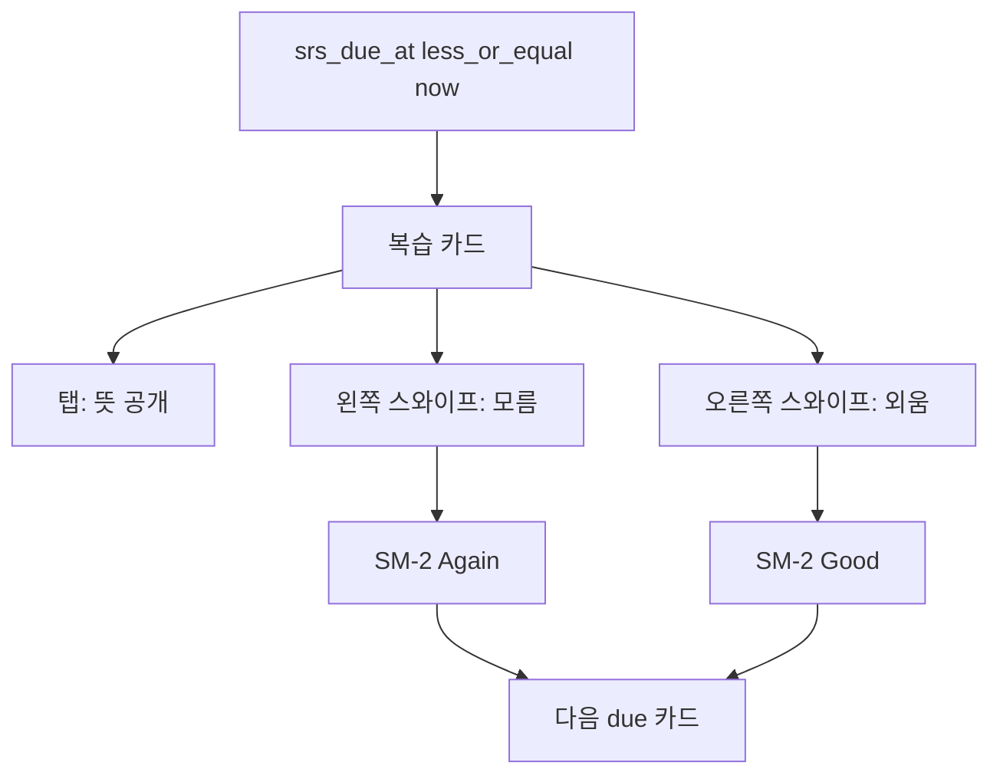
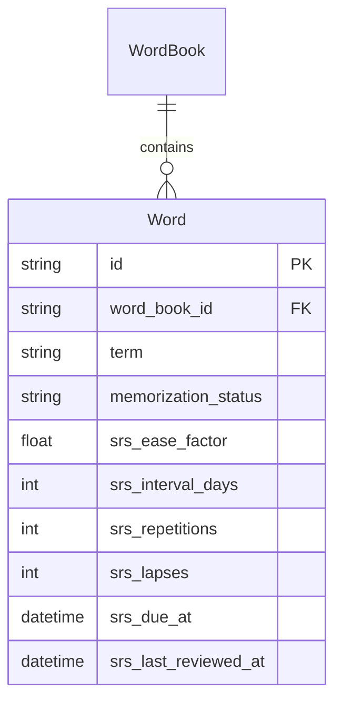

# Nyaki SRS 복습 플랜 (확정)

> 작성: 2026-07-28  
> 상태: **설계 확정 · 구현 전**  
> 관련: [SRS.md](SRS.md) (SM-2 계산 로직) · [DOMAIN.md](DOMAIN.md) · [API.md](API.md) · [../app_erd.md](../app_erd.md)

---

## 한 줄 요약

**SM-2는 엔진만**, 학습자 UI는 **모름 / 외움** 두 가지.  
복습은 **좌·우 스와이프 = 채점 + 다음**(B안). **v1은 앱에서만** “오늘 복습” 제공 (웹은 [향후 개선 검토](#향후-개선-검토-v2-후보) 참고).

---

## 제품 결정

| 항목 | 결정 |
|------|------|
| 알고리즘 | Anki식 **SM-2** |
| 학습자 입력 | **모름** / **외움**만 (Hard / Easy 없음) |
| 내부 매핑 | 모름 → `Again`, 외움 → `Good` |
| 클라이언트 | **앱만 (v1)** — 웹 복습 UI는 보류, 사유는 [향후 개선 검토](#향후-개선-검토-v2-후보) |
| 복습 UX (앱) | **B안**: 왼쪽 = 모름, 오른쪽 = 외움 → 자동 다음 |
| 탭 | 뜻 공개 / 숨김만 |
| 세로 스와이프 | 복습 모드에서 **사용 안 함** (좌우와 충돌 방지) |
| 버튼 | 접근성·발견용으로 동일 동작(선택) |
| 기존 테스트 | 유지. 복습은 **due 큐 전용** 세션 |

### 왜 B안인가

채점(버튼)과 넘기기(세로 스와이프)를 동시에 두면 조작이 둘로 갈라져 UX가 나빠진다.  
**한 제스처 = 채점 + 다음**으로 합친다.

---

## UX 흐름

| 제스처 | 동작 |
|--------|------|
| 탭 | 뜻 공개/숨김 |
| 왼쪽 스와이프 | 모름 → Again → 다음 |
| 오른쪽 스와이프 | 외움 → Good → 다음 |
| 세로 스와이프 | 복습에서 비활성 |
| 모름/외움 버튼 | 스와이프와 동일 (접근성) |

시각 피드백: 스와이프 중 좌/우에 “모름” / “외움” 힌트, 임계치 넘기면 채점 확정.

**웹:** v1 범위 아님. 웹은 여전히 `memorizationStatus`를 읽기 전용으로만 표시(수정 UI 없음) — 복습 채점 화면 자체를 만들지 않는다.

---

## 데이터 / ERD

관계 유지: `WordBook (1) —— (N) Word`  
스케줄은 **Word 컬럼**에 붙인다. 새 sync entity 없음.

### Word에 추가할 필드

| Field | Type | Default | Notes |
|-------|------|---------|--------|
| `srs_ease_factor` | float | `2.5` | SM-2 ease |
| `srs_interval_days` | int | `0` | 다음 간격(일) |
| `srs_repetitions` | int | `0` | 연속 성공 횟수 |
| `srs_lapses` | int | `0` | Again으로 리셋된 횟수 |
| `srs_due_at` | datetime | `created_at` | **복습 큐 키** (즉시 due) |
| `srs_last_reviewed_at` | datetime? | `null` | 마지막 채점 시각 |

### `memorization_status` (호환 유지)

- 모름(Again) → 즉시 `unmemorized`
- 외움(Good)이고 `srs_repetitions >= 2` (= 3일 간격 단계 진입) → `memorized`
- 그 전(`repetitions < 2`)까지는 `unmemorized` 유지

목록 암기율은 당분간 이 필드 유지.

### SM-2 매핑 (v1)

정확한 계산식·반올림 규칙·워크스루는 **[SRS.md](SRS.md)에 확정**되어 있다. 여기서는 제품 관점 요약만:

- Again(모름) → ease 하락(하한 1.3), reps 리셋, due = +1일
- Good(외움) → ease 변화 없음, reps에 따라 1일 → 3일 → `interval × ease`로 증가, due = now + interval
- Hard / Easy 분기 없음, ease는 Good으로는 절대 오르지 않음 (의도됨 — Anki 기본 ease 2.5와 동일 전제)
- 당일 재학습(분 단위 relearning step) 없음 — Again도 최소 내일 재노출

---

## 구현 레이어

### Hub (`api/`)

- Alembic: `words`에 SRS 6컬럼 + index `(user_id, srs_due_at)`
- Pydantic / sync payload에 필드 포함
- `GET /v1/review/due?limit=` — `is_deleted = false`, `srs_due_at <= now`, `ORDER BY srs_due_at ASC`
- v1은 채점 클라이언트가 앱 하나뿐이라 이중 채점 충돌은 발생하지 않음 (여러 기기에서 같은 앱을 쓰는 경우는 기존 sync 충돌 규칙에 위임)

### Flutter

- Drift tables + schema bump
- `Word` 모델 · Create/Update · sync JSON
- `lib/data/srs/sm2.dart` — Again / Good만
- 복습 세션: 좌우 스와이프, 세로 스크롤 잠금
- 홈/테스트에 “오늘 N”

### Sync

- entity_type `word`만 확장
- 구버전: 필드 없으면 default
- 충돌: `updated_at` 최신 wins (채점 시 `updated_at` · `srs_last_reviewed_at` 갱신)

---

## 마이그레이션

1. **Hub 먼저** → 기존 row: ease=2.5, interval=0, reps=0, lapses=0, `due_at = created_at`, `last_reviewed_at = null`
2. 이미 `memorized`인 단어: `due_at = now + 3 days`, `reps = 2`, `interval = 3` (Good 2회 통과 상태로 간주 — 정상 진행 단계값을 그대로 재사용해 즉시 due 폭주 완화)
3. Drift 동일 기본값
4. 클라이언트는 Hub 배포 후

**롤백:** 추가 컬럼은 전부 nullable/default가 있어 하위 호환됨 → 문제 발생 시 Hub는 이전 버전으로 재배포만 하면 되고(신규 컬럼은 무시됨), 컬럼 자체를 되돌릴 필요는 없음. 앱/웹도 신규 필드 없이 동작 가능하므로 클라이언트 롤백은 일반 배포 롤백과 동일.

---

## 구현 순서

| # | 작업 | 상세 |
|---|------|------|
| 1 | 문서 | [SRS.md](SRS.md) (신규, SM-2 수식·2버튼 매핑·스와이프 UX) · [DOMAIN.md](DOMAIN.md) (Word SRS 필드) · [hub_erd.md](hub_erd.md) (신규, Hub Postgres ERD) · [../app_erd.md](../app_erd.md) (Drift SRS 컬럼) · [API.md](API.md) (Word JSON + `GET /v1/review/due`) · [README.md](README.md) 링크 · [../notes/product/features-v0.1.md](../notes/product/features-v0.1.md) `F-R-01` |
| 2 | Hub | migration + schemas + due API |
| 3 | SM-2 로직 | Flutter 순수 함수(`sm2.dart`) + 소량 테스트 |
| 4 | 앱 | Drift · sync · 좌우 스와이프 복습 UI |
| 5 | 검증 | 채점 → due 갱신 → 홈/테스트 화면 반영까지 앱 내에서 확인 |

---

## 부록: 범위 밖 / 기각안

**v1에서 빼는 것**

- **웹 복습 UI** (사유는 아래 [향후 개선 검토](#향후-개선-검토-v2-후보))
- Hard / Easy UI, 4버튼 SM-2 (학습자 인지 부담)
- FSRS / 분 단위 learning steps
- `review_logs` 히스토리 테이블
- 푸시 알림 “오늘 복습”
- `memorization_status` 완전 제거
- 복습에서 세로 스와이프로 넘기기 (버튼/스와이프 이중 조작 방지)

**기각된 UX 안**

| 안 | 내용 | 이유 |
|----|------|------|
| A | 버튼 = 채점+다음, 스와이프 없음 | B로 확정 |
| C | 위/아래 스와이프 = 채점 | 세로 피드와 충돌 |

---

## 향후 개선 검토 (v2 후보)

확정되지 않은 추후 아이디어. 착수 확정 전까지는 이 섹션에만 남겨둔다.

### 웹 복습 UI 보류 사유

Hub의 `upsert_word`(`api/app/services.py`)는 필드 단위가 아니라 **row 전체**를 `updated_at`이 더 최신인 쪽으로 덮어쓴다. 단어 내용(뜻·예문) 수정은 저빈도 쓰기라 지금까지 충돌이 거의 없었지만, 복습 채점은 **하루에도 수십 번** 일어나는 고빈도 쓰기다. 웹에도 채점 기능을 넣으면: 앱에서 뜻을 수정 → 동기화 전에 웹이 옛 뜻을 들고 그 단어를 채점 → 웹 payload에 옛 뜻이 통째로 실리고 `updated_at`은 방금 것이라 서버가 최신으로 받아들임 → 앱에서 고친 뜻이 사라짐. v1은 채점 클라이언트를 앱 하나로 좁혀서 이 문제 자체를 없앴다.

다시 넣는다면 먼저 정할 것: **A.** 리스크 감수하고 현재 방식 그대로 추가, **B.** `PATCH /v1/words/{id}/review` 같은 채점 전용 부분 업데이트 엔드포인트를 분리해 SRS 6필드만 갱신(권장). B 선택 시 SM-2를 TS(`sm2.ts`)로 이중 구현하게 되므로 [SRS.md](SRS.md)의 round half up 규칙·워크스루 벡터를 그대로 포팅해 앱과 동일한 출력이 나오는지 검증해야 한다.

### 로컬 전용 → 클라우드 전환 시 SM-2 이관

로컬 Drift `WordEntries`와 Hub `words`는 SRS 필드까지 컬럼 이름·의미가 거의 1:1([app_erd.md](../app_erd.md) ↔ [hub_erd.md](hub_erd.md))이고, `upsert_word`는 해당 id가 서버에 없으면 그냥 새로 만든다. 즉 "로컬 전용 단어를 처음 서버에 올리는 것"과 "신규 단어 생성"이 코드 경로상 동일 — 별도 변환 로직 불필요.

빠진 조각: [sync_coordinator.dart](../lib/data/sync/sync_coordinator.dart)는 `SyncOutbox`에 쌓인 것만 업로드하는데, `SyncOutbox`는 "동기화가 켜진 이후" 변경분만 쌓이는 큐라서 로그인 자체를 안 하고 몇 달 써온 로컬 데이터는 애초에 outbox에 없다. → **계정 최초 연결 시 로컬 DB 전체를 한 번에 outbox로 밀어넣거나 직접 업로드하는 일회성 백필 경로**가 필요하다.

착수 시 확인할 것: `POST /v1/sync/push`의 최대 100건 제한(API.md) → 배치 분할 필요 / 백필 도중 실패 시 재시도 — outbox 방식 재사용이면 기존 `_is_newer` 충돌 규칙으로 자연히 idempotent / 이 시나리오는 항상 "로컬이 서버보다 최신"이라 `updated_at` 충돌은 실질적으로 발생하지 않음(서버에 해당 id가 아예 없는 최초 1회).

### 무한 증식 로그 — Hub `sync_changes` vs 로컬 `SyncOutbox`, 전략이 다르다

근본 원인은 같다: word row가 갱신될 때마다 로그 테이블에 row가 하나씩 append되고 정리 로직이 없다. SRS 채점이 붙으면 채점 1회 = word row 갱신 1회라서 이 로그도 채점 빈도만큼 쌓인다. 다만 **Hub와 로컬은 소비자 구조가 달라서 정리 전략을 다르게 가져가야 한다.**

#### Hub `sync_changes` — **모듈 3~4 배포 전 결정 필요**

`upsert_word`가 호출될 때마다 `_new_change()`(`api/app/services.py`)가 `sync_changes`에 row를 하나씩 추가한다. 지금까지는 단어 CRUD 정도의 저빈도 쓰기라 문제없었지만, 복습 채점은 하루에도 수십 번 일어나는 고빈도 쓰기라 유저 1인이 하루 30회만 채점해도 1년에 유저당 만 건 이상 무한 누적된다. 여러 디바이스가 서로 다른 cursor 위치에서 pull해가므로 "누가 어디까지 읽었는지"를 고려해야 하는 게 복잡도의 핵심이다.

방향(미정, 착수 시 결정): **A. 주기적 정리 배치** — 모든 디바이스가 특정 cursor를 이미 지나쳤으면 그 이전 로그 삭제. **B. 압축(compaction)** — 같은 `entity_id`에 여러 row가 쌓이면 오래된 것을 지우고 최신 것만 유지(`sync_pull`은 어차피 `entity_id`로 최신 엔티티 상태를 재조회하는 구조라 중간 row는 이미 무가치). Linear류의 WAL tailing 방식은 CDC 인프라 투자가 필요해 지금 규모엔 과하다 — nyaki는 개인 유저의 멀티디바이스 동기화 수준이라 가벼운 A/B 해법이면 충분하다는 판단.

#### 로컬 `SyncOutbox` — write-time 압축으로 충분, 배치 불필요

같은 패턴이지만 원인과 심각도가 다르다. `_enqueueWord`/`_enqueueWordBook`(`lib/data/repositories/drift_vocab_repository.dart`)이 단어를 수정할 때마다 로그인 여부와 무관하게 무조건 `SyncOutbox`에 새 row를 insert하는데, 같은 entity에 대한 기존 미전송 row가 있는지 체크하지 않는다 — 이건 SRS와 무관하게 **지금 이미 존재하는 비효율**이다 (로그인 전이나 20초 sync 주기 사이에 같은 단어를 여러 번 고치면 그만큼 중복 row가 쌓임).

`sync()`(`lib/data/sync/sync_coordinator.dart`)는 로그인 상태가 아니면 즉시 리턴하므로, 로그인을 안 한 유저는 outbox가 계속 쌓인다. 다만 로그인하는 순간 100건씩 배치로 push된 뒤 삭제되므로 "영구 미해결"이 아니라 "로그인 전까지 지연"에 가깝다.

Hub와 다르게 **로컬 outbox는 소비자가 이 기기 하나뿐**이라 여러 cursor를 신경 쓸 필요가 없다 → **write-time 압축만으로 충분**하다: 새 row를 넣기 전에 같은 `(entity_type, entity_id)`의 기존 미전송 row를 지우고 하나만 유지하면, 별도 배치/스케줄러 없이 entity당 최대 1행으로 상한이 걸린다.

**정리:** Hub `sync_changes`는 여러 유저가 공유하는 서버 자원이라 모듈 3~4 배포 전 A/B 중 하나를 반드시 결정해야 하고, 로컬 `SyncOutbox`는 기기별 저장공간이라 심각도는 낮지만 고치는 방법(write-time 압축)이 훨씬 간단하므로 모듈 4(Drift 스키마 작업)에서 같이 처리하는 게 효율적이다.

### Hub 쓰기 부하 / 동시 접속 처리량 — 분석 완료, 지금은 액션 불필요

위 로그 정리(A/B)와는 완전히 다른 축이다. 로그를 아무리 잘 정리해도 **채점 1회 = `words` UPDATE 1 + `sync_changes` INSERT 1**이라는 요청 하나당 쓰기 비용 자체는 줄지 않는다 — 이건 구조적으로 당연한 것이라 "해결"할 대상이 아니라 "현재 배포 설정이 이 비용을 감당할 수 있는지" 확인이 필요한 부분이다.

**현재 설정 확인 결과**

- [api/Dockerfile](../api/Dockerfile): `uvicorn app.main:app ...` — `--workers` 옵션 없음, 프로세스 1개로만 구동
- [api/DEPLOY.md](../api/DEPLOY.md): Lightsail $5~10 플랜 (vCPU 1, RAM 512MB~2GB 수준)
- [api/app/database.py](../api/app/database.py): `create_engine`에 pool 크기 미지정 → SQLAlchemy 기본값(`pool_size=5`, `max_overflow=10`) = 동시 DB 커넥션 최대 15개
- 라우트가 전부 `def`(동기) — FastAPI가 threadpool에서 실행, `async def`/`asyncpg` 아님

→ 정확히 같은 순간에 몰리는 요청 기준 상한은 15~25 정도. 다만 쿼리 하나가 수십ms 수준이라, 하루 중 분산돼서 쓰는 활성 유저 기준으로는 DAU 수백~1천 명대까지는 무리 없을 것으로 추정된다 (실측 아님, 설정값 기반 추정치).

**병목 신호(레이턴시 증가, 커넥션 풀 타임아웃 등) 관측 시 확장 순서**

1. **설정값만 조정 (거의 무비용)** — `uvicorn --workers N`, SQLAlchemy `pool_size`/`max_overflow` 확대, Lightsail 플랜 업그레이드. 이것만으로 지금보다 자릿수 하나 이상 여유 확보 가능.
2. **표준 패턴** — pgbouncer 커넥션 풀러, 읽기 위주 엔드포인트(`GET /v1/word-books`, `GET /v1/review/due`)에 read replica/캐시(Redis) 적용.
3. **본격 확장** — `user_id` 샤딩, 비동기 쓰기 큐(Kafka/RabbitMQ), 멀티 리전.

**지금 결정: 3단계는 미리 도입하지 않는다.** 실트래픽이 없는 상태에서 샤딩·큐·멀티 리전을 선제적으로 넣는 건 (포트폴리오 관점에서도) 권장하지 않기로 함 — 검증되지 않은 인프라를 미리 갖추는 것보다, "왜 지금은 필요 없고 필요해지면 뭘 어떤 순서로 할지"를 문서화해두는 쪽이 더 설득력 있는 판단이라고 봄. 1단계만으로도 당장은 충분한 여유가 생기므로, 실제 병목 신호가 나타날 때 순서대로 적용한다.

### `SyncCoordinator` 20초 폴링 — 백그라운드 낭비 개선 여지 (지금 스코프 아님)

[sync_coordinator.dart](../lib/data/sync/sync_coordinator.dart)의 `sync()`는 로그인 상태 변화 시 + `Timer.periodic(20초)`로 반복 호출된다. `_push()`는 outbox가 비어있으면 네트워크 요청을 아예 안 하지만, `_pull()`은 **바뀐 게 하나도 없어도 매번 `GET /v1/sync/pull` 요청을 보낸다** — 순수 폴링이라 "혹시 바뀐 거 있어?"를 20초마다 무조건 물어보는 구조.

**지금 방식이 이 앱 규모엔 괜찮은 이유**

- nyaki는 유저 1명이 기기 1~2대 쓰는 개인 단어장이라, 여러 사람이 동시 편집하는 협업 툴 수준의 실시간성(수백ms 이내 반영)이 필요 없다. 몇 초~20초 지연은 체감상 문제 없음.
- WebSocket 등 상시 연결 방식은 모바일 백그라운드 제약(iOS/Android 둘 다 백그라운드 소켓을 강제 종료함) 때문에 결국 "포그라운드는 소켓, 백그라운드는 별도 방식"을 또 만들어야 해서 복잡도만 커짐. 지금 서버가 uvicorn 워커 1개 + 동기 DB 드라이버 구조라 상시 연결 지원 자체가 아키텍처 변경 수준.
- 트래픽 비용도 활성 기기 100대 기준으로 계산해봐도 초당 5건 안팎 — 위 "Hub 쓰기 부하" 항목에서 확인한 서버 스펙 여유 안에 있어 실제 병목은 아님.

**그래도 남는 낭비: 백그라운드에서도 타이머가 계속 돎.** 사용자가 화면을 안 보고 있어도 20초마다 배터리·트래픽을 씀 — UX 이득이 0인 순수 낭비 구간.

**개선안(저비용):** `WidgetsBindingObserver`로 앱 lifecycle을 감지해서, **백그라운드 진입 시 타이머 정지 / 포그라운드 복귀 시 타이머 재개 + 즉시 1회 `sync()` 호출**. 특정 화면(예: 복습 화면) 진입 이벤트가 아니라 **앱 전체가 안 보이던 상태 → 다시 보이는 상태로 바뀌는 OS 레벨 이벤트** 기준 — 새 인프라(FCM·WebSocket) 없이 앱 루트 근처에 옵저버 하나만 추가하면 됨. 부가 효과로 "다른 기기에서 고치고 이 기기 앱을 열면 바로 반영" 문제도 같이 해결됨.

**더 발전시키면 (당장 필요 없음):** Firebase를 이미 쓰고 있으니, Hub가 변경 발생 시 FCM으로 "동기화 필요" 신호만 보내고 그걸 받았을 때만 `sync()`를 트리거하는 이벤트 기반 방식으로 폴링 자체를 없앨 수 있음. 지금 규모엔 오버엔지니어링이라 보류.

**착수 시점:** 모듈 4 스코프 아님. 별도 작업으로 나중에 처리.

### 알고리즘 개인화 (FSRS Optimizer 확장 여지)

지금은 SM-2(고정 파라미터, [SRS.md](SRS.md))로 v1 구현. Anki는 2023년부터 FSRS로 전환했고 SM-2보다 예측 정확도가 검증돼 있어, 도입한다면 새 알고리즘을 직접 설계하기보다 FSRS 오픈소스 Optimizer(유저별 파라미터 재학습, GPU 불필요) 재사용이 합리적이다.

전제조건(지금 빠져 있음): `WordModel`은 "현재 최신 SRS 상태"만 저장하고 개별 복습 이벤트 히스토리(언제/며칠 만에/맞았는지)는 남기지 않는다. 개인화 학습을 하려면 `review_log(user_id, word_id, reviewed_at, elapsed_days, rating)` 같은 append-only 이벤트 테이블이 먼저 필요하고, 유저당 데이터가 일정량(수백 회 이상) 쌓여야 통계적으로 의미가 있다 — 그 전엔 오버피팅 위험만 크다.

착수 판단: 알고리즘이 SM-2 하나뿐이고 사용처가 앱 하나뿐인 지금은 오버엔지니어링 — 알고리즘 종류가 늘거나 사용 플랫폼이 실제로 늘 때 재검토. `review_log` 테이블 자체는 개인화 계획이 확정 안 됐어도 "언젠가 필요해질 관찰 데이터"라서, SM-2 채점 로직 구현(모듈 3) 시점에 미리 테이블만 만들어두는 것도 고려할 만하다.
