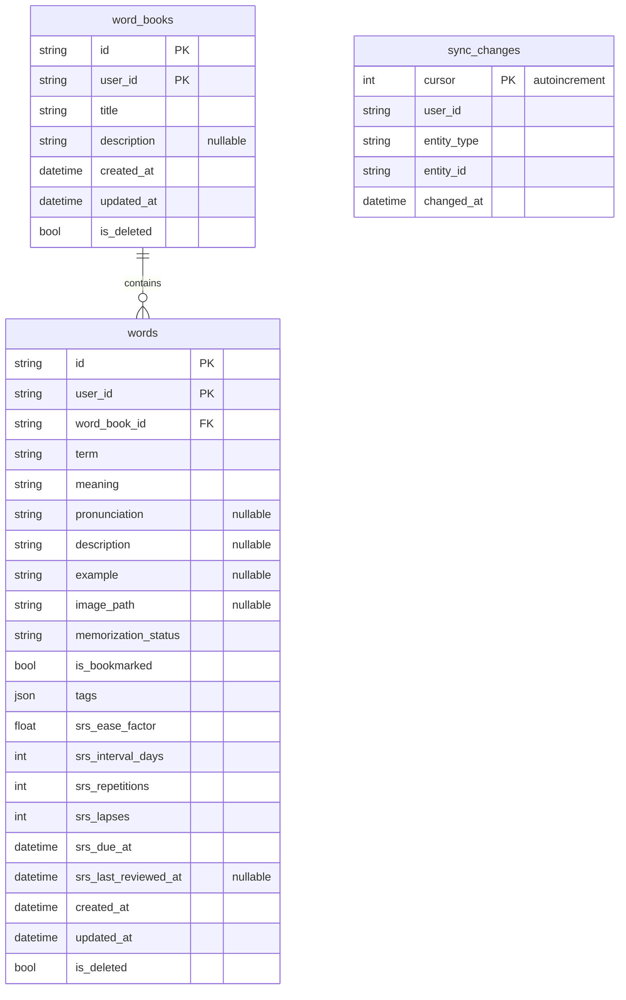

# Hub ERD — Postgres

Sync Hub(`api/`)가 실제로 저장하는 스키마 정리. 구현: [api/app/models.py](../api/app/models.py).

> 앱 로컬(Drift) ERD는 [app_erd.md](app_erd.md) — 컬럼 이름은 대부분 같지만 Hub는 `(id, user_id)` 복합 PK로 여러 사용자를 한 DB에 격리하고, 앱은 `user_id` 없이 기기당 한 사용자만 저장한다는 차이가 있다.

---

## ERD

`srs_*` 컬럼: 계산 규칙은 [SRS.md](SRS.md), 마이그레이션은 [../api/alembic/versions/0003_word_srs_fields.py](../api/alembic/versions/0003_word_srs_fields.py) 참고.

---

## 인덱스

| 테이블 | 인덱스 | 용도 |
|--------|--------|------|
| `word_books` | `(user_id, updated_at)` | sync pull |
| `words` | `(user_id, updated_at)` | sync pull |
| `words` | `(user_id, word_book_id)` | 단어장별 목록 |
| `words` | `(user_id, is_bookmarked)` | 북마크 필터 |
| `words` | `(user_id, srs_due_at)` | `GET /v1/review/due` |
| `sync_changes` | `(user_id, cursor)` | 증분 pull |

---

## 관련 문서

- 도메인 규칙: [DOMAIN.md](DOMAIN.md)
- API 페이로드: [API.md](API.md)
- SRS 계산 로직: [SRS.md](SRS.md)
- 앱 로컬 ERD: [app_erd.md](app_erd.md)
